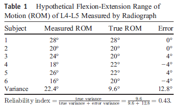
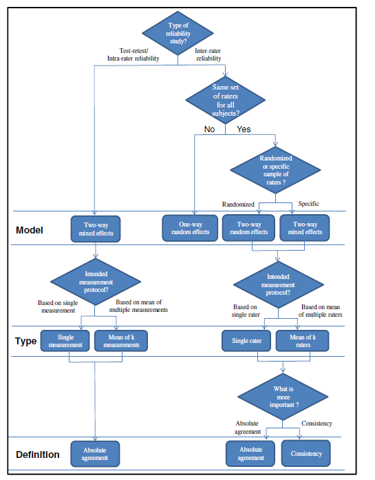
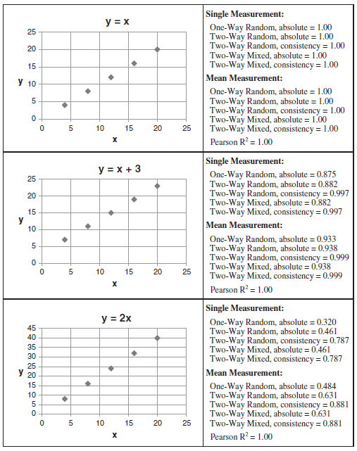
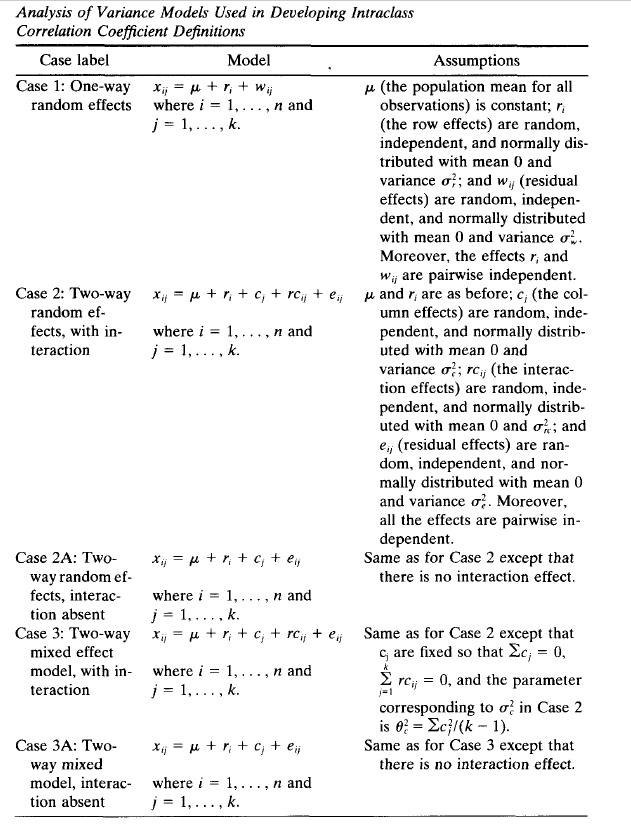
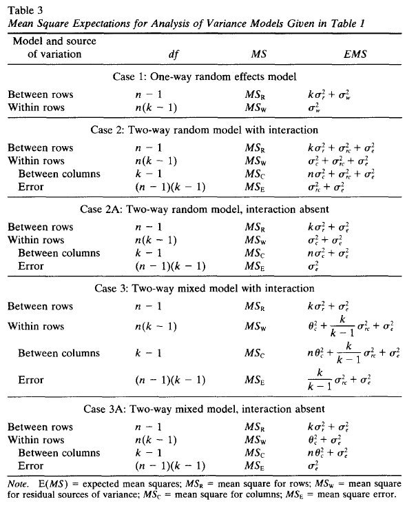
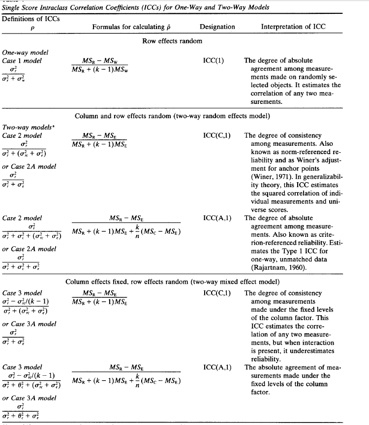
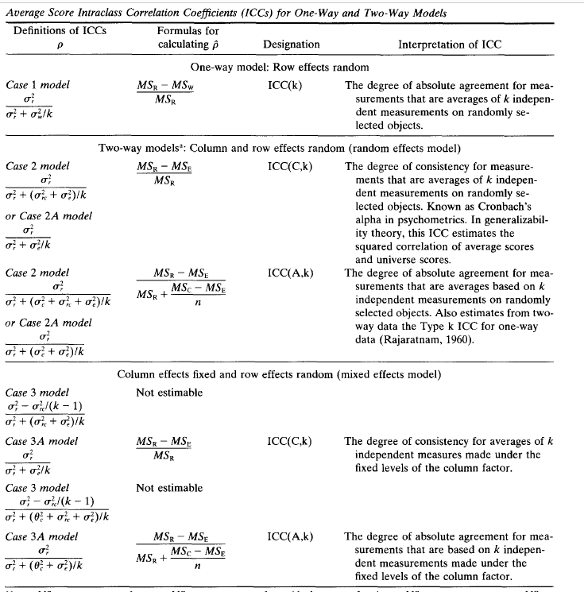

```{r setup, include=FALSE}
knitr::opts_chunk$set(echo = TRUE, message = F, warning = F)
library(tidyverse)
library(knitr)
library(kableExtra)
library(nlme)
library(irr)
library(psych)
```

# Introduction 

Reliability is defined as the extent to which measurements can be replicated. In other words, it reflects not only degree of correlation but also agreement between measurements. Mathematically:

$$\text{reliability} = \frac{\text{true variance}}{\text{true variance + error variance}}$$

Historically, Pearson correlation coefficient, paired t test, and Bland-Altman plot have been used to evaluate reliability.
However, paired t test and Bland-Altman plot aremethods for analyzing agreement, and Pearson correlation coefficient
is only a measure of correlation, and hence, they are nonideal measures of reliability. A more desirable
measure of reliability should reflect both degree of correlation and agreement between measurements. Intraclass
correlation coefficient (ICC) is such an index.



Nowadays, ICC has been widely used in conservative care medicine to evaluate interrater, test-retest, and intrarater reliability.


**Types of Reliablity**


# Forms of ICC

Shrout and Fleiss in 1979 defined 6 forms of ICC based on:

1. the “Model” (1-way random effects, 2-way random effects, or 2-way fixed effects)

2. the “Type” (single rater/measurement or the mean of k raters/measurements)

McGraw and Wong in 1996(the definition in SPSS) defined 10 forms of ICC based on: 

1. the “Model” (1-way random effects, 2-way random effects, or 2-way fixed effects)

2. the “Type” (single rater/measurement or the mean of k raters/measurements)

3. the “Definition” of relationship considered to be important (consistency or absolute agreement).


# Selection of ICC Form 

Since McGraw and Wong's definition is more complete, now we discuss the selection of correct form of ICC using their definition. 

## "Model" Selection

**1. One-Way Random-Effects Model**

Each subject is rated by a **different** set of raters who were randomly chosen from a larger
population of possible raters. For example, in a multicenter study, one set of raters may assess a subgroup of subjects in one center and another set of raters may assess a subgroup of subjects in another center.


**2. Two-Way Random-Effects Model**


Each subject is rated by a **same** set of raters who were randomly chosen from a larger population of possible raters. Here, we plan to generalize our reliability results to any raters who possess the same characteristics as the selected raters in the reliability study. 

This model is appropriate for evaluating rater-based clinical assessmentmethods (eg, passive range of motion) that are designed for routine clinical use by any clinicians with specific characteristics (eg, years of experience) as stated in the reliability study.

**3. Two-Way Mixed-Effects Model**

Each subject is rated by a **same** set of raters and the selected raters are the only raters of interest. Here, the results only represent the reliability of the specific raters involved in the reliability experiment. They cannot be
generalized to other raters even if those raters have similar characteristics as the selected raters in the reliability
experiment. As a result, this is less commonly used in interrater reliability analysis.

## "Type" Seletion

This selection depends on how the measurement protocol will be conducted in actual application.

For instance, if we plan to use the mean value of 3 raters as an assessment basis, the experimental design of the reliability study should involve 3 raters, and the **“mean of k raters”** type should be selected. 

Conversely, if we plan to use the measurement from a single rater as the basis of the actual measurement, **“single rater”** type should be selected even though the reliability experiment involves 2 or more raters.


## “Definition” Selection

For both 2-way random- and 2-way mixed-effects models, there are 2 ICC definitions: “absolute agreement”
and “consistency.” Selection of the ICC definition depends on whether we consider absolute agreement or
consistency between raters to be more important.
Absolute agreement concerns if different raters assign the same score to the same subject.
Conversely, consistency definition concerns if raters’ scores to the same group of subjects are correlated in an additive manner. 

Consider an interrater reliability study of 2 raters as an example. In this case, consistency definition
concerns the degree to which one rater’s score (y) can be equated to another rater’s score (x) plus a systematic
error (c) (ie, y = x + c), whereas absolute agreement concerns about the extent to which y equals x.


# Reliability and ICC

For interrater reliability, all the ten forms could be possible depending on the situation. 

For test-retest and intrarater reliability, the ICC selection process is more straightforward. The only question to ask is whether the actual application will be based on a single measurement or the mean of multiple measurements.

As for the “Model” selection, Shrout and Fleiss suggest that 2-way mixed-effects model is appropriate for testing intrarater reliability with multiple scores from the same
rater, as it is not reasonable to generalize one rater’s scores to a larger population of raters. 

Similarly, 2-way mixed-effects model should also be used in test-retest reliability study because repeated measurements cannot be regarded as randomized samples.

In addition, absolute agreement definition should always be chosen for both test-retest and intrarater reliability studies because measurements would be meaningless if there is no agreement between repeated measurements.

A side note here, the definition from Shrout and Fleiss is still popular among researchers. Looking into the formula, ICC2(k) for two-way random, absolute will give the same value as two-way mixed, absolute. ICC3(k) is for two-way mixed, consistency. We should be careful reporting the form of ICC. For example, [in this study](https://jfootankleres.biomedcentral.com/articles/10.1186/s13047-015-0111-8), it says "ICC(3,1/k) is reported for test-retest reliabilty" and says 'absolute agreement' in the footnote. It could be confusing as people might think they used two-way mixed, consistency for this.



# ICC Characteristics 

1. If the data sets are identical, all ICC estimates will equal to 1. 

2. Generally speaking, ICC of the “mean of k raters” type is larger than the corresponding “single rater” type. 

3. The “absolute agreement” definition generally gives a smaller ICC estimate than the “consistency” definition. 

4. One-way random-effects model generally gives a smaller ICC estimate than the 2-way models. 

5. For the same ICC definition (eg absolute agreement), ICC estimates of both the 2-way random- and mixed-effects models are the same because they use the same formula to calculate the ICC. This brings up an important fact that the difference between 2-way random- and mixed-effects models is not on the calculation but on the experimental design of the reliability study and the interpretation of the results.



# ICC Interpretation

There are no standard values for acceptable reliability using ICC. A low ICC could not only reflect the low degree of rater or measurement agreement but also relate to the lack of variability among the sampled subjects, the small number of subjects, and the small number of raters being tested. 

As a rule of thumb, researchers should try to obtain at least 30 heterogeneous samples and involve at least 3 raters
whenever possible when conducting a reliability study.

Under such conditions, we suggest that ICC values less than 0.5 are indicative of poor reliability, values between 0.5 and 0.75 indicate moderate reliability, values between 0.75 and 0.9 indicate good reliability, and values greater
than 0.90 indicate excellent reliability.

Moreover, the ICC estimate obtained from a reliability study is only an expected value of the true ICC. It is
logical to determine the level of reliability (ie, poor, moderate, good, and excellent) by testing whether the obtained ICC value significantly exceeds the suggested values mentioned above using statistical inference. 


# Report ICC

We suggest that the best practice of reporting ICC should include the following items: 
software information, “Model,” “Type,” and “Definition” selections. In addition, both ICC estimates and their 95% confidence intervals should be reported. 

For instance, ICC estimates and their 95% confident intervals were calculated using SPSS statistical package version
23 (SPSS Inc, Chicago, IL) based on a mean-rating (k = 3), absolute-agreement, 2-way mixed-effects model.

# Model Definition 

This table shows the definition of different models. The case labels 1,2, and 3 are taken from Shrout and Fleiss (1979), who did not formally consider Cases 2A and 3A.

Consider there are n subjects and k raters. Each row is a subject and each column is a rater. 




## Mean Square Expectations 



## ICC Calcaulation 


### single score ICC 



### average score ICC




# R examples 

We’ll use the anxiety data from `irr` package, which contains the anxiety ratings of 20 subjects, rated by 3 raters. Values are ranging from 1 (not anxious at all) to 6 (extremely anxious).


```{r}

data("anxiety")
head(anxiety, 4)

```

we’ll consider the function icc() from `irr` package and the function ICC() from `psych` package.

## `irr` package 

Specify model(oneway or twoway), type(consistency or agreement) and unit(single or average). Based on the document for this function, "If a "oneway" model is used, only "consistency" could be computed". Actually, there is only one ICC for single or average in one-way data.And there is no discrimination in agreement and consistency.To be accurte, it should show how the scores from different raters for a single subject are similar(and thus, absolute agreement)

```{r}
irr1 = icc(
  anxiety, model = "oneway", 
  unit = "single"
  )

irr1k = icc(
  anxiety, model = "oneway", 
  unit = "average"
  )

irr2A= icc(
  anxiety, model = "twoway", 
  type = "agreement", unit = "single"
  )

irr2AK= icc(
  anxiety, model = "twoway", 
  type = "agreement", unit = "average"
  )

irr2C= icc(
  anxiety, model = "twoway", 
  type = "consistency", unit = "single"
  )

irr2CK= icc(
  anxiety, model = "twoway", 
  type = "consistency", unit = "average"
  )


icc_summary_using_irr = function(icc_from_irr){
  tibble(form = paste(icc_from_irr$model, icc_from_irr$type, icc_from_irr$unit, sep = ','),
       name = icc_from_irr$icc.name,
       icc = icc_from_irr$value,
       lower = icc_from_irr$lbound,
       upper = icc_from_irr$ubound) %>% 
  mutate_if(is.numeric, ~round(.,3)) %>% 
  mutate(icc_CI = paste0('(', lower,',' , upper, ')')) %>% 
  select(-lower, -upper)
  
  
}


map_df(list(irr1, irr1k, irr2A, irr2AK, irr2C, irr2CK),icc_summary_using_irr ) %>% 
  kable() %>% kable_styling()
```


## `psych` package

`ICC` function gives all six forms of ICC using Shrout and Fleiss's definition. 

```{r}
icc_psych = ICC(anxiety)

icc_psych$results %>% 
  add_column(form = c('one way, single, agreement', 
                      'two way, single, agreement',
                      'two way, single, consistency',
                      'one way, average, agreement',
                      'two way, average, agreement',
                      'two way, average, consistency')) %>% 
  mutate_if(is.numeric, ~round(.,3)) %>% 
  mutate(icc_CI = paste0('(', `lower bound`,',' , `upper bound`, ')')) %>% 
  select(form, type, ICC, icc_CI ) %>% 
  kable() %>% 
  kable_styling()
  
```

The two packages give the same results, except for the slight difference in CI for ICC(2,k).

## Calculate from scratch 

To get a better understanding of ICC, now we calculate ICC from scratch.


First we transform the data into a long format and fit a LME model.


```{r}
anxiety_long = anxiety %>% rownames_to_column('id') %>% 
  gather(key = 'rater', value = 'score', -id) %>% mutate(id = as.numeric(id)) %>% 
  arrange(id, rater)

head(anxiety_long)
```

### One way model 

Fit a LME model with only intercept as a fixed effect and random effect.

$$Y_{ij} = \beta_0 + r_i + e_{ij},\;\; r_i:\text{each row for each subject}$$


$$r_i \sim N(0, \sigma^2_r) \; \;e_{ij} \sim N(0, \sigma^2) $$
```{r}
lme1 = lme (score ~ 1, random = ~ 1 | id,  data = anxiety_long)

summary(lme1)

VarCorr(lme1)

between_var = VarCorr(lme1)[1,1] %>% as.numeric()
within_var = VarCorr(lme1)[2,1] %>% as.numeric()


#one way ICC from LME
between_var/(between_var + within_var)
```

Here, $\sigma^2_r$ is `r VarCorr(lme1)[1,1]`, $\sigma^2$ is `r VarCorr(lme1)[2,1]`. 

$$ICC = \frac{\sigma^2_r}{\sigma^2 +\sigma^2_r} = 0.175$$

This is the same as previous result for one way random effect, single measure.


### Two way model

Fit a LME model with only intercept as a fixed effect. Its random effects include the subjects and raters. This is a crossed random effect, not a nested random effect. 

$$Y_{ij} = \beta_0 + r_i + c_i + e_{ij}$$
$$r_i:\text{each row for each subject}, c_i:\text{each column for each rater}$$


$$r_i \sim N(0, \sigma^2_r) \; \;c_i \sim N(0, \sigma^2_c), e_{ij} \sim N(0, \sigma^2) $$

```{r}

lme2 = lme4::lmer(score ~ 1 + (1 | id) + (1 | rater), data=anxiety_long)

summary(lme2)

varcomp = VarCorr(lme2) %>% as.data.frame() %>% select(-var1, -var2, -vcov)


row_var = varcomp[1,2]^2 
column_var = varcomp[2,2]^2 
residual_var = varcomp[3,2]^2 
# two way ICC, consistency from LME
row_var/(row_var + residual_var)

# two way ICC, agreement from LME 
row_var/(row_var + column_var +residual_var)

```

Here, $\sigma^2_r$ is `r row_var`, $\sigma^2_c$ is `r column_var`, $\sigma^2$ is `r residual_var`. 

For two way consistency:

$$ICC = \frac{\sigma^2_r}{\sigma^2 +\sigma^2_r} = 0.216$$
For two way agreement:

$$ICC = \frac{\sigma^2_r}{\sigma^2 +\sigma^2_r + \sigma^2_c} = 0.198$$

This is the same as previous results.


# Conclusion 

Shrout and Fleiss in 1979 defined 6 forms of ICC: 

- ICC(1,1): one way, single measure, agreement.

- ICC(2,1): two way mixed model or two way random model, single measure, agreement.

- ICC(3,1): two way mixed model or two way random model, single measure, consistency.

- ICC(1,k): one way, average measure, agreement.

- ICC(2,k): two way mixed model or two way random model, average measure, agreement.

- ICC(3,k): two way mixed model or two way random model, average measure, consistency.


The conbination of "Model"(one way or two way random or two way mixed), "Type"(single or average), "Definition"(agreement or consistency) leads to McGraw and Wong's definition in 1996 of ten forms.


To assess test-retest reliabity, **two way mixed model, agreement** should be used. This corresponds to ICC(2,1/k). If in actual application, only a single measure will be used, we should use ICC(2,1). If the average of k measures will be used, we should use ICC(2,k). Also, we can simply report both if it's not clear. 


# Reference 

1. Koo TK, Li MY. A Guideline of Selecting and Reporting Intraclass Correlation Coefficients for Reliability Research [published correction appears in J Chiropr Med. 2017 Dec;16(4):346]. J Chiropr Med. 2016;15(2):155-163. doi:10.1016/j.jcm.2016.02.012

2. McGraw KO, Wong SP. Forming inferences about some intraclass correlation coefficients. Psychol Methods 1996;1:30–46.

