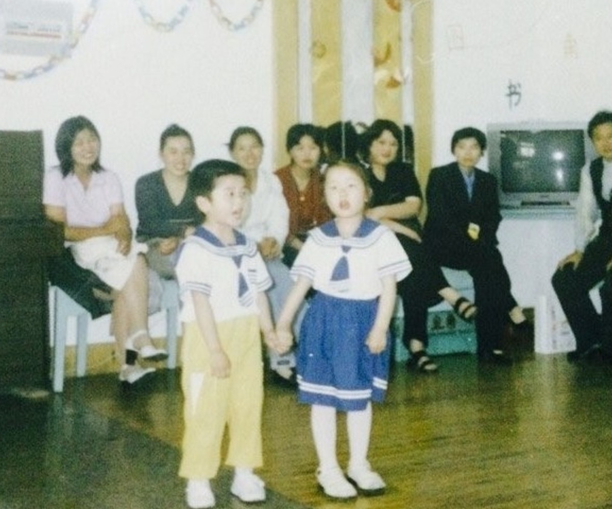
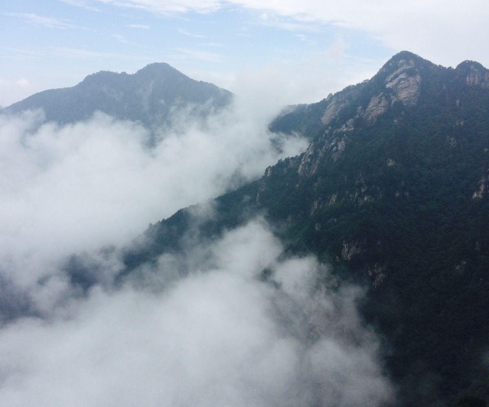
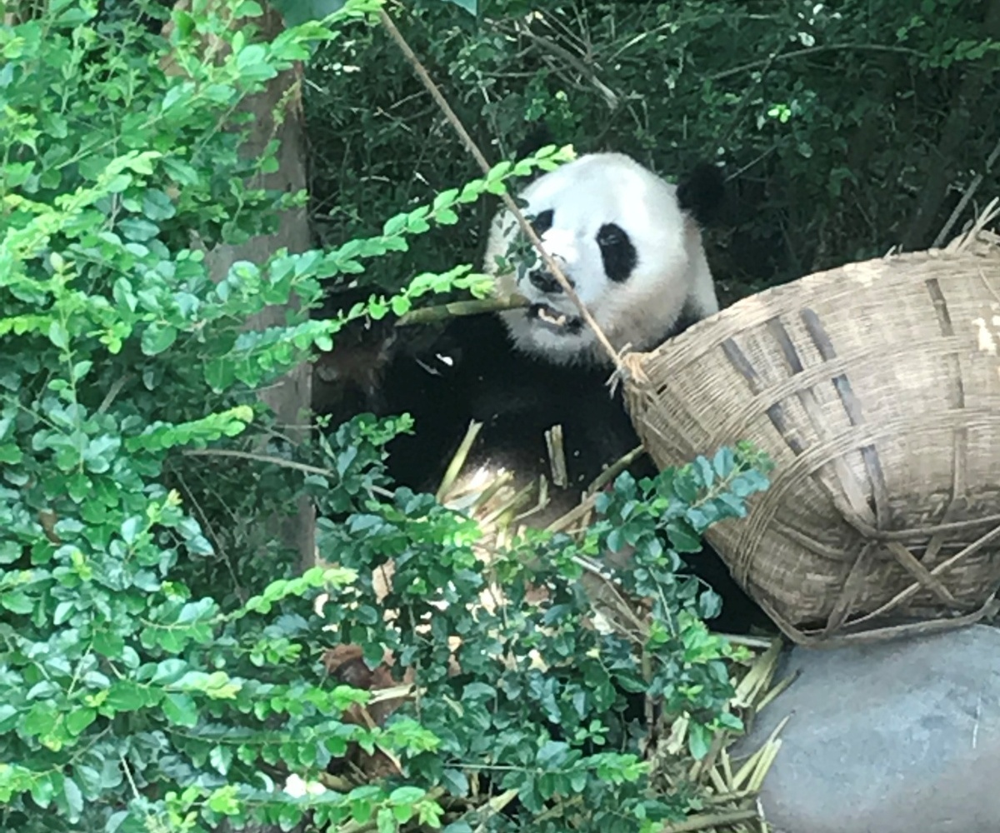

Hey, I'm Jiyue.

 
<link rel="stylesheet" href="https://cdnjs.cloudflare.com/ajax/libs/font-awesome/4.7.0/css/font-awesome.min.css">

<i class="fa fa-graduation-cap" style="font-size:15px;margin-left:-2px"></i>M.S., Department of Biostatistics, Columbia University

<i class="fa fa-location-arrow" style="font-size:18px;"></i>NYC

<i class="fa fa-home" style="font-size:18px;"></i>From across the Pacific Ocean but can't swim

<i class="fa fa-heart" style="font-size:16px;"></i>Boba Tea

<i class="fa fa-code-fork" style="font-size:18px;margin-left:5px"></i>Data Science in Health Care

 

<h3> What I have done in my 20s </h3>

   

   
 Deep Learning for Cancer Detection from Pathology Images

    
   Using hematoxylin and eosin (H&E) stained whole-slide images of lymph node sections, an algorithm was developed to automate detection of cancer metastases in these images. To cope with the extremely large size of the image, patch extraction and transfer learning were utilized. 

   [Read more](cancer_detection.html)
   

   

   

   
  Patient Compliance Analysis and Prediction in Clinical Trials 

    
   
   - Calendar heatmap was built to visualize compliance rate in the practice of eCOA.
   
   - Holiday, weekday and length of the instrument are some of the significant factors that can affect compliance.
  
   - The best predictive model using random forest achieves a test AUC of 0.79.
   
   - R shiny app was built to streamline this analysis for further clinical trials
   
   [Check out this R shiny app](https://jiyueqin.shinyapps.io/ediary_compliance/){target="_blank"}
   

   

   

   
 Columbia Landmark Recognition Using CNN

    
   A small example of [Tensorflow JavaScript](https://www.tensorflow.org/js){target="_blank"}. Convolutioanl neural networks were built from self-collected landmark images.
   Future updates will include more landmarks.
   
[Upload your image and try it out](https://jiyueqin.github.io/landmark_recognition/){target="_blank"}

   

   

   

   
 Health Data Analysis in NYC 

    
   
   - Analysis: Correlation of Risk Factors with Coronary Disease and Stroke at Census-tract level(2015-2016)
   
   - NYC Map: App showing the prevalence of Health Indicators throughout New York City
   
   - [Find Your Risk](https://jiyueqin.shinyapps.io/framingham/){target="_blank"}: App to predict the 10-year cardiovascular risk using the Framingham algorithm
   
   [Analysis website](https://alc2279.github.io/p8105_final_project/){target="_blank"}
   

   

   
   

   
 Hadza Hunter-gathers' Gut Metagenome Analysis

    
   
Through variant calling analysis, we found eight prevalent species have significant SNP enrichments in wet season. 83 genes were identified with the most characteristic SNP distributions between wet season and dry season. Many of these genes are from metabolic pathways like carbon metabolism and glycolysis. This implies the impact of seasonal chnages on mutational patterns and functions for gut microbiome of an unindustrialized population.

   
[Publication](https://pubmed.ncbi.nlm.nih.gov/33509082/){target="_blank"}

   

<h3> Soon I will be 80 years old </h3>

I would look back on the journey and feel first time seeing the world just happened yesterday.

I would be grateful to all the support, joy but also hardship and imperfection.

  
   Kindergarten
  Good job holding hands!

  
  Starry Night
  Got another use out of my flashlight

  
   Roomates
  Bye, four year dorm life. Hello, old friends!

  
   Sather Tower
  First day at Berkeley

  
   Sunset
  I love the sunset when I am happy.

  
   Dabie Mountain
  We made it to the top!

  
   Chengdu Celebrity
  Panpan wants color photos too.

  
   Bellaruby
  Who is that gorgeous?

  
   Thailand
  We are off to Phuket Island!

