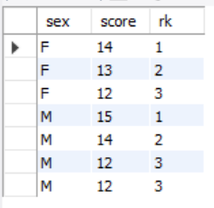

```{r setup, include=FALSE}
library(tidyverse)
library(sqldf)
```

This question collection is mainly for queries. I will try to provide solutions in R, SQL and maybe Python!

# Question 1

select the top 3 from each group in a dataset

## prepare dataset 

```{r prep}
data = tibble(
       sex = c(rep("F",4), rep("M",5)),
       score = c(12,13,11,14,10,12,14,12,15) # there can be ties
)

```

## window functions 

The easiest way to do this question is through *Window functions*.

Aggregate functions like `mean()` takes n inputs and produces a single output(down-column function).

Non-aggregate functions like `DateDiff(x1, x2)` takes some inputs and produces a single output(across-column function)

Window functions, in contrast, take n inputs and return n outputs, and the outputs depend on all the inputs. There are several categories of window functions; you’re most likely to need ranking functions and offsets.


## solution using R

```{r}
data %>%
  group_by(sex) %>% 
  mutate(rank = min_rank(desc(score))) %>%  # ties are considered 
  filter(rank < 4) %>% 
  arrange(sex, desc(score))

```


## solution using sql
```{r eval=FALSE}
# select top 3 in whole dataset, SELECT TOP 3 not working (ACCESS version)
sqldf("SELECT * FROM data ORDER BY score DESC LIMIT 3")

# I didn't find the way to do this using sqldf 

#### this is the sql code ##########
SELECT *
FROM(
 SELECT *, RANK() 
            OVER (PARTITION BY sex
			      ORDER BY score DESC) AS rk
FROM score) AS i
WHERE rk < 4;
###################################
```




